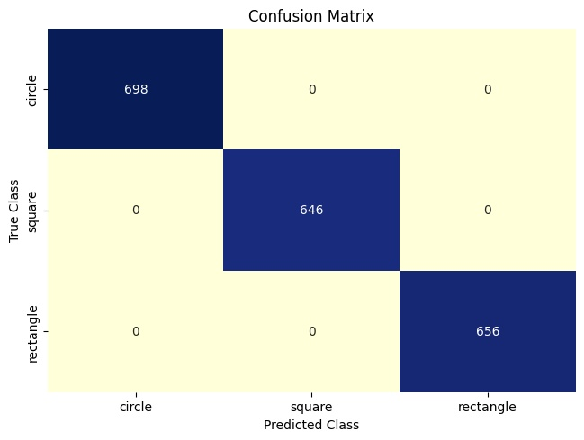
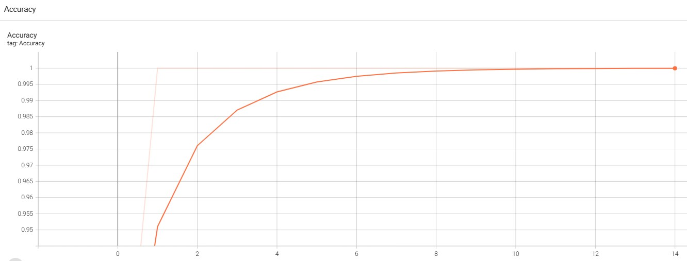
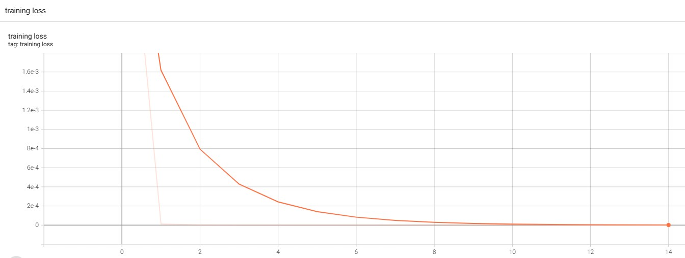

# ai_library
This repository contains code for a Convolutional Neural Network (CNN) implemented using PyTorch library. The repository includes files for training the model from scratch, evaluating the performance of the model by loading pre-trained weights, and the neural network architecture. The randomly generated shapes (like: circle, square, and rectangle) dataset is used for training the model.

## Repository Files

This repository contains the following files:

1)  models/ folder: This folder contains the trained parameters for the CNN model.
2)  NeuralNet.py: This file contains the implementation of the CNN architecture using PyTorch.
3)  Train.py: This script is used to train the CNN model from scratch.
4)  Evaluation.py: This script is used to test the CNN model on the MNIST dataset and also generates a confusion matrix evaluation in the results/ folder.
5)  runs/shape folder: This folder contains the TensorBoard logs for the CNN model. You can launch TensorBoard using the following command in your terminal:
```
tensorboard --logdir runs/mnist
```
## Results: Confusion Martix:
The prediction results from deep learning model is evaluted using confusion matrix:


## Results: Accuracy and Training Loss curve:
We also present a loss and accuracy curve during the training




